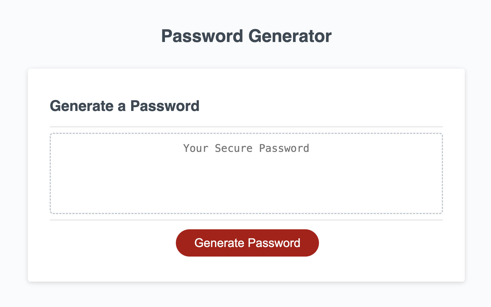

# numCharSpecial_PWGenerator

## Description

In this project, I created a function using JS to generate a random password based on the user's input. My main motivation for creating this password generator was to learn how to apply all the knowledge I've gained so far. With all the hacking and chaos going on in the world, having a secure password is one worry I can cross off my list. 

The only downside I've encountered: there is a 99.99% chance of me forgetting my secure password, haha! 

Overall, I had so much fun learning about how to create functions and variables in Javascript.


## Installation

Nothing to install to generate your secure password! Just click the link below:
https://love4tau.github.io/numCharSpecial_PWGenerator/

## Usage


    ```md
    
    ```

## Credits
https://developer.mozilla.org/en-US/docs/Web/JavaScript/Reference/Statements/const - referred to this document